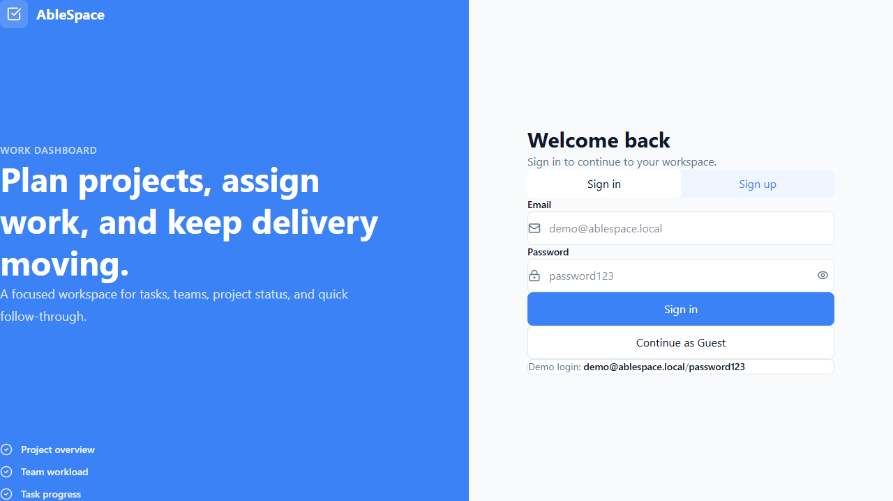
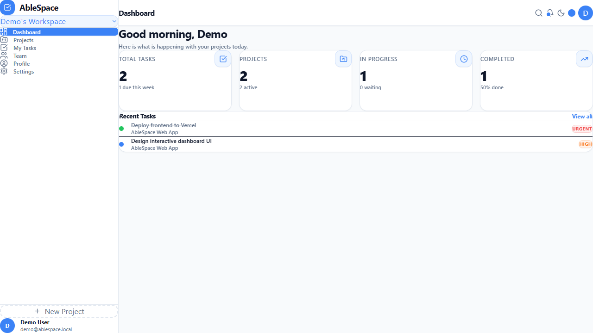
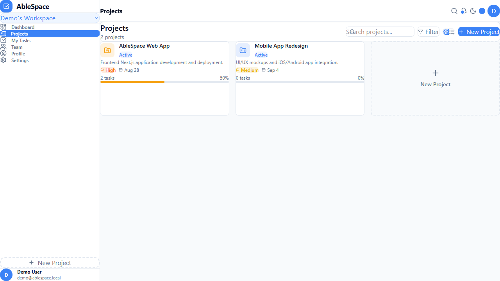
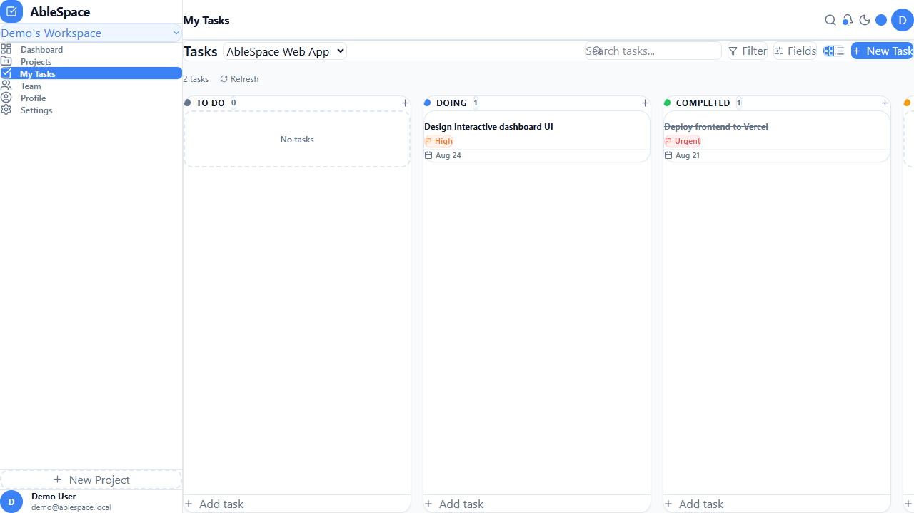

# AbleSpace — Project Walkthrough & Screenshots

## 🔗 Project Links
- **Live Vercel Application**: [https://frontend-sepia-delta-p7x6mrrj9q.vercel.app](https://frontend-sepia-delta-p7x6mrrj9q.vercel.app)
- **GitHub Repository**: [https://github.com/Akashvasan2003/AbleSpace](https://github.com/Akashvasan2003/AbleSpace)

---

## 📸 Screenshots & Visual Walkthrough

### 1. Login & Authentication Screen
The entry point allows sign in, registration, or instant guest access.

### 2. Dashboard Overview
Interactive metrics showing total tasks, active projects, tasks in progress, and completion velocity.

### 3. Projects View
Card-based overview of active and archived projects with lead assignment and progress bars.

### 4. Tasks Board & List View
Kanban board and list views with status toggles, priorities, subtasks, and comments.

---

## 🛠️ Tech Stack & Features
- **Frontend**: Next.js 16 (App Router) + TypeScript + Tailwind CSS v4 + Lucide Icons
- **Backend**: NestJS + TypeScript + Passport JWT + Prisma v7
- **Database**: PostgreSQL / PGlite
- **Deployment**: Vercel (Frontend) + GitHub CI sync
